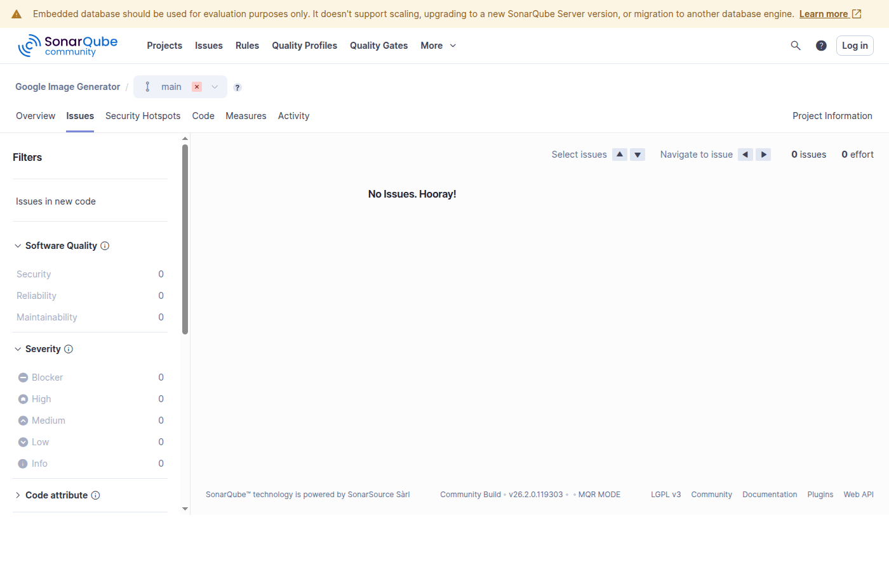
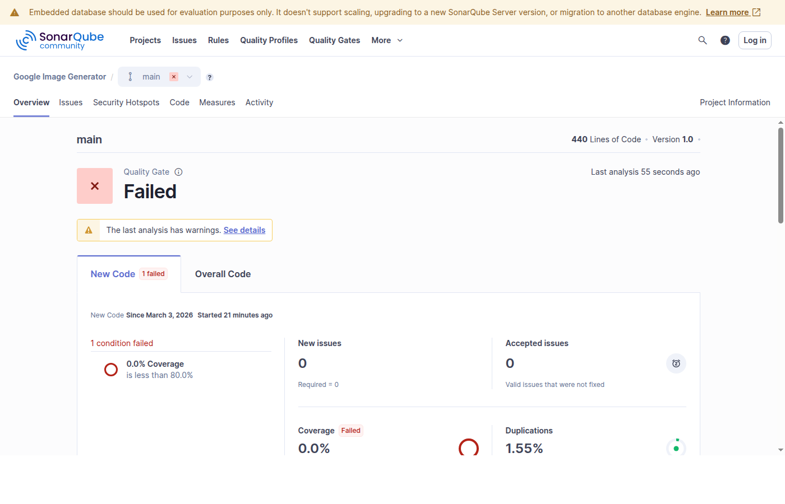

# AI Image Generation Toolkit

Generate professional 2K and 4K images from the command line using Google's Gemini API. Text-to-image, style transfer, and character re-posing — all from two lightweight Python scripts.

## What You Get

- **`generate_image.py`** — Multi-reference image generation. Combine a content image with a style reference, or generate from text alone. Supports up to 2 reference images.
- **`generate_image_single_refv2.py`** — Single-reference generation with built-in identity preservation. Create a character once, then re-pose it into any scene while keeping its face, features, and style consistent.
- **`image_gen_utils.py`** — Shared utilities (API communication, file handling, image processing) used by both scripts.

Both scripts support 2K and 4K output, parallel batch generation, and automatic filename collision handling.

## Quick Start

```bash
# Install the one dependency
pip install requests

# Set your API key
export GEMINI_API_KEY="your-api-key-here"

# Generate an image from text
python3 generate_image.py "A serene mountain landscape at sunset" landscape.png

# Generate with a style reference
python3 generate_image.py "Product photo in watercolor style" output.png \
    --ref1 product.jpg --ref2 watercolor_ref.jpg --quality 4k

# Re-pose a character (preserves identity)
python3 generate_image_single_refv2.py \
    "Same character presenting at a conference podium, dramatic lighting" \
    character_presenting.png --ref1 original_character.png

# Batch generate 5 variations
python3 generate_image.py "Your prompt here" output.png --quantity 5
```

## Requirements

- Python 3.8+
- `requests` library
- A Google Cloud API key with the Generative Language API enabled

## Example Images

The `examples/` directory contains 7 images generated with these scripts:

| File | Description |
|------|-------------|
| `01_business_pipeline_diagram.png` | Business workflow infographic from text |
| `02_business_cost_comparison.png` | Cost comparison proof-of-concept diagram |
| `03_cartoon_professional_woman.png` | Cartoon-style professional character |
| `04_cartoon_professional_team.png` | Multi-character team collaboration scene |
| `05_original_character.png` | Original robot mascot (base for re-posing) |
| `06_character_reposed_presenting.png` | Same robot re-posed: presenting at conference |
| `07_character_reposed_working.png` | Same robot re-posed: working at a desk |

Images 5-7 demonstrate the character re-posing workflow: generate once, re-use everywhere.

## The Full Guide

For a comprehensive walkthrough — setup instructions, prompt engineering tips, business use cases, cost breakdowns, and the full command reference — the complete guide is available as a published PDF:

**[AI Image Generation Toolkit — The Complete Guide (Etsy)](https://www.etsy.com/listing/YOUR_LISTING_ID)**

The guide covers:
- Step-by-step Google Cloud setup
- How reference images work (content vs. style vs. identity preservation)
- Sample prompts for business diagrams, marketing assets, illustrations, and character workflows
- Business cases for marketing teams, product teams, and freelancers
- Cost estimation tables and tips for best results

## Code Quality

This codebase is continuously scanned with [SonarQube](https://www.sonarqube.org/) for bugs, vulnerabilities, code smells, and security hotspots.

| Metric | Result |
|--------|--------|
| Bugs | 0 |
| Vulnerabilities | 0 |
| Code Smells | 0 |
| Security Hotspots | 0 |
| Reliability Rating | A |
| Security Rating | A |
| Maintainability Rating | A |
| Duplication | 1.55% |

**SonarQube Issues — "No Issues. Hooray!"**



**SonarQube Dashboard — New Issues: 0, Duplication: 1.55%**



## Pricing (Google API)

| Quality | Approximate Cost |
|---------|-----------------|
| 2K | ~$0.134 per image |
| 4K | ~$0.24 per image |

Pricing is set by Google and subject to change. Check [Google's AI pricing](https://ai.google.dev/pricing) for current rates.

## License

MIT
